import ImageGrid from '../../components/ImageGrid.astro';

**Role:** Project Lead, UX Research, UX Design, Workshop Facilitator

Blackwoods approached me to look at their existing web experience (primarily on desktops) and identify areas we could improve the overall customer experience. There were a number of UX issues they had identified through internal analysis and their customer support team, but they also wanted me to do a deeper dive and find other issues they might not be aware of.

After an initial kick-off meeting, I conducted a heuristic evaluation of the entire website to systematically identify usability issues and potential easy wins, as they wanted to take an iterative approach — "evolution not revolution." Although heuristic evaluations can be subjective, they can help highlight areas that need more exploration and research. This process surfaced a number of usability issues that were causing customers to have a negative experience. I then developed rapid mockups to visualise the proposed changes and worked with the development team to implement them. The end result was a much improved customer experience that was more user-friendly and intuitive.

## Problem

Blackwoods needed a UX review of their website to identify any areas where they could make improvements to help customers find products more easily.

## Solution

1. Identify and improve critical flows and pages
2. Optimise the current site to eCommerce best practice
3. Generate updated UI visual designs where necessary

### Tools

- Excel
- Sketch
- Hotjar
- Google Analytics
- Usertesting.com
- Interviews

### Skills

- Business strategy
- UX analysis and recommendations
- User research
- Information architecture
- Visual design
- Content review

## Competitor analysis

When starting with a new client I always like to do a competitor analysis to understand the business landscape in which they operate. Competitors usually have similar challenges and have attempted to solve these in different ways. There are always potential nuggets of gold in a competitor's experience that can be useful.

<ImageGrid cols={3}>
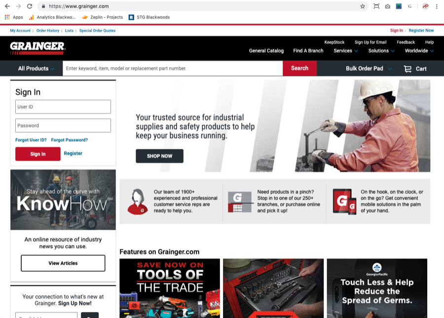

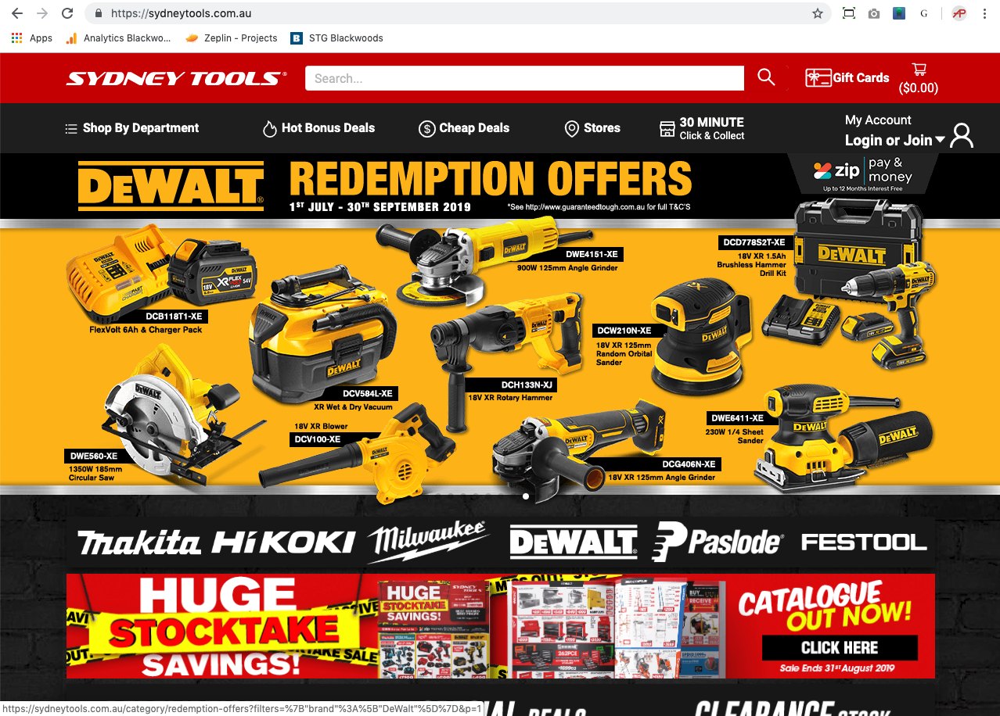

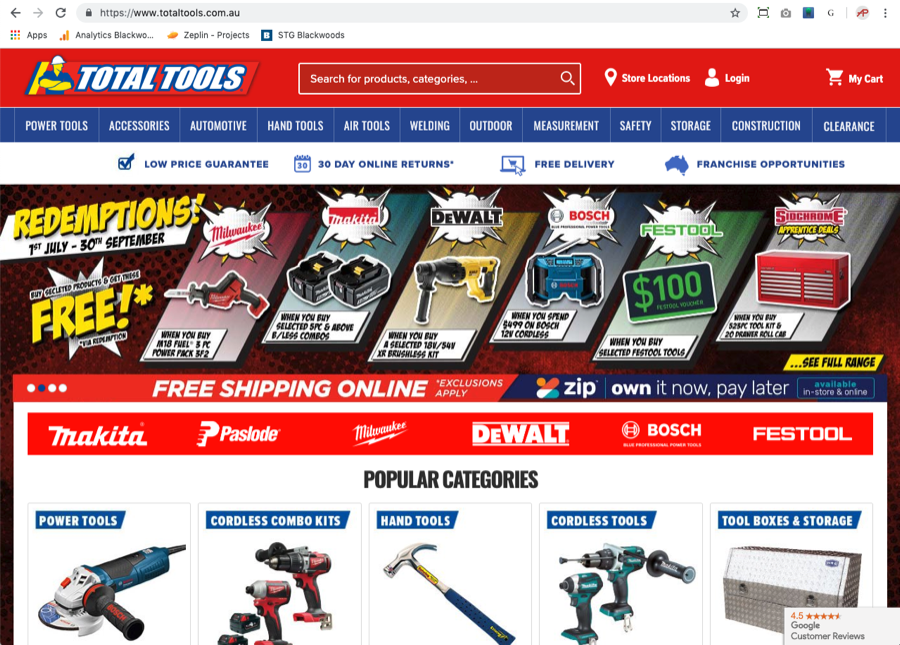

</ImageGrid>

## Heatmaps

<ImageGrid cols={3}>
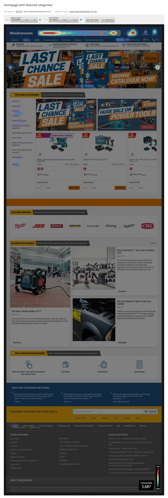

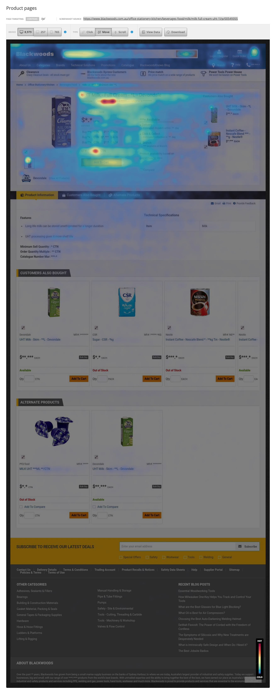

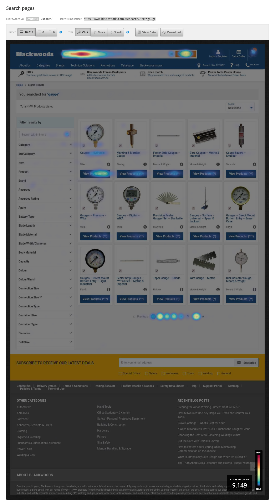

</ImageGrid>

## Responsive design

### Responsive issue

The existing website employed a responsive design to accommodate various viewports. While responsive design is a suitable approach in certain cases, the implementation on this website was flawed. The page was set to always scale to the full width of the browser window, regardless of its dimensions. This caused issues when the browser window width was changed, as the content did not scale properly and the proportions of the page elements became uneven. This disruption in the visual hierarchy resulted in secondary content being given too much emphasis and important content being pushed down the page — banner advertising dominating the viewport while featured products disappeared below the fold.

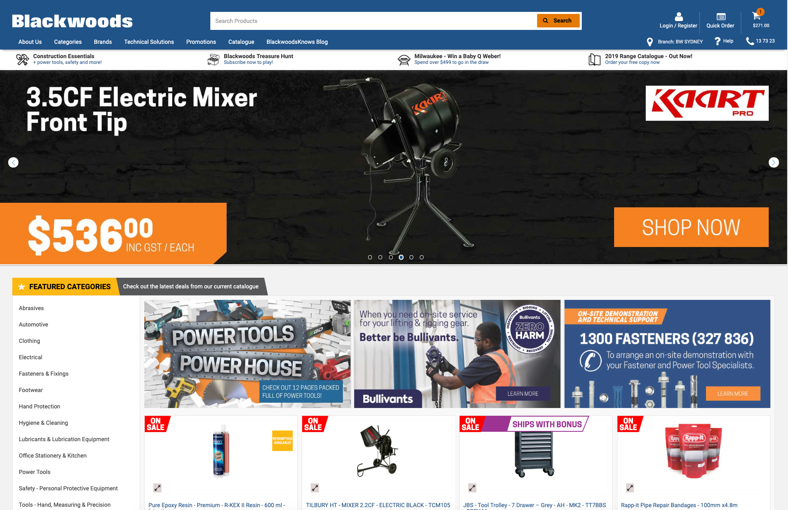

### Simple solution

I suggested a straightforward and easy solution: instead of changing the website design, set the maximum width of the website to 1260px while centering it within the browser window. If the browser window is wider than this, only the header colour spans the full width, which helps visually frame the page content. This approach preserves the website's design while addressing the scaling issues, returning visual balance, content hierarchy and image integrity (no overscaling or pixellation). Users could now easily scan through the content without excessive scrolling.

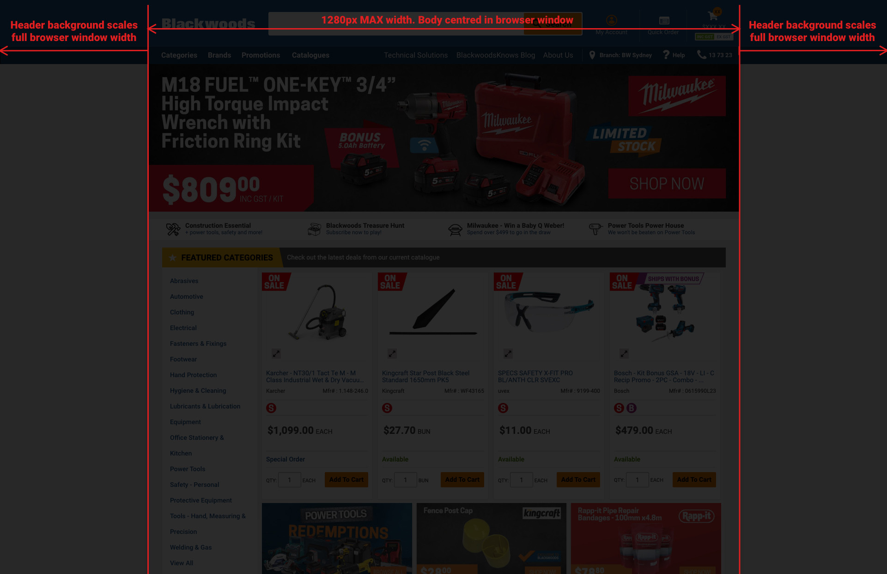

## Search results page

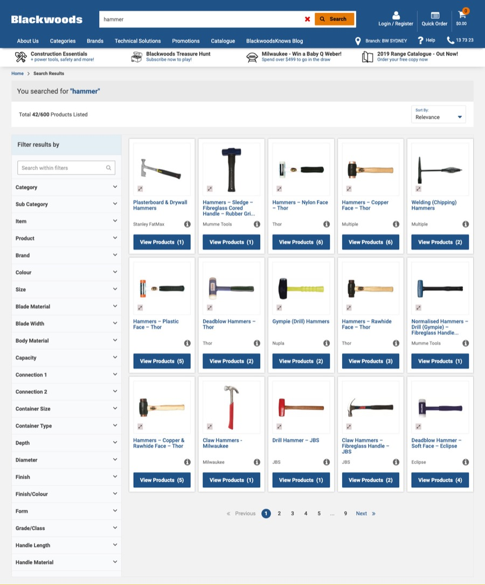

Blackwoods' existing search results page had several issues. The grid approach allowed for the display of many items, but confusing categorisation and a lack of screen space for related information per category or product caused problems. Users were also required to click on each product to view information that should have been readily available, and there was no call-to-action for adding items to their cart immediately.

### Updated search results

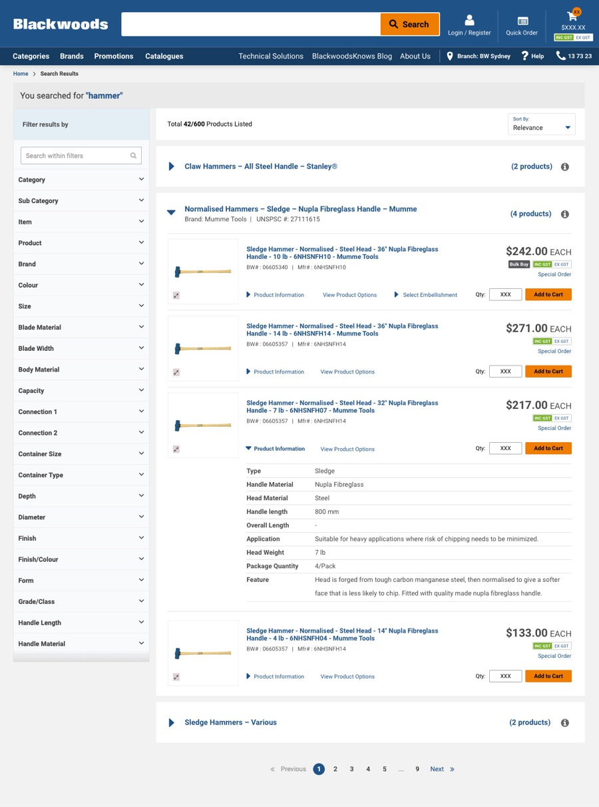

I added a horizontal accordion UI pattern to show higher-level categories that could easily be drilled into. Product-level content was surfaced so the customer didn't have to click through to a PDP page to see the critical info required to make a purchase decision. The buy CTA is displayed directly on the page so the item can be added to the cart, also allowing the user to continue browsing without leaving the page.

## Mega-menu

### Mega-menu issues

The mega-menu had a number of issues, but the most glaring was the lack of categories and alphabetical sections. Heat maps also showed quite clearly that no users were interacting with the advertising banner, which dominated the menu.

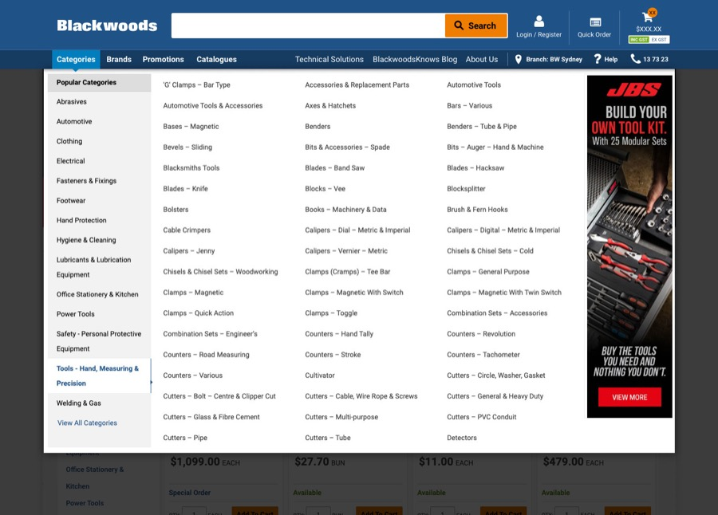

### Mega-menu update

Instead of a huge unordered list, I created a secondary categorisation to group products under higher-level categories. I removed repeated words to reduce visual clutter and grouped related items where relevant. The overall result was a menu that was easier to scan, which helped customers find the items they were looking for more easily.

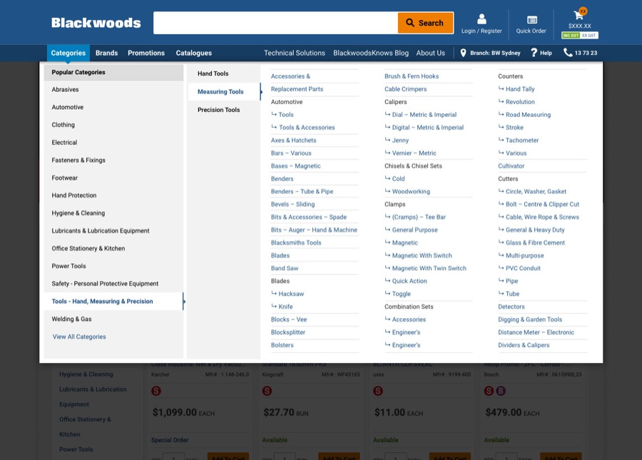

## Learnings

Working on a B2B business was a new experience for me. It was the first time I'd encountered a business with a small customer base with the potential opportunity to talk directly with them. Unfortunately, due to COVID I was unable to get meetings with them, which was a lost opportunity to really understand their needs for the Blackwoods platform.

I still had a great opportunity to talk with internal leaders and understand their challenges, and to gain insight into areas we could address to help their customers have better experiences.

Throughout this project I learned that every business is different, with different motivations driving their customers. I learned to listen closely to internal team members, as they often had valuable insights — and it reinforced that there are always nuggets of data hiding, when you look in the right places and ask the right people.
