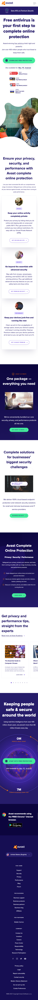
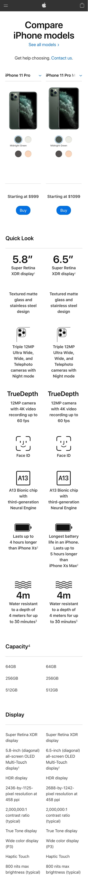
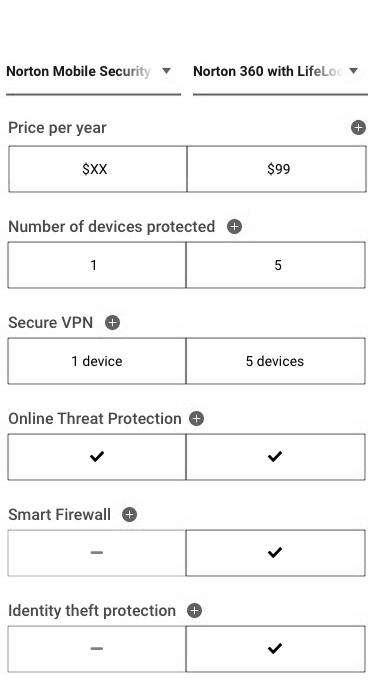
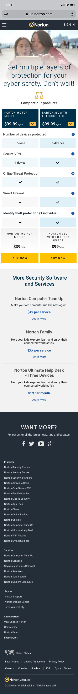
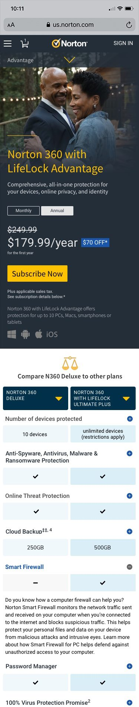
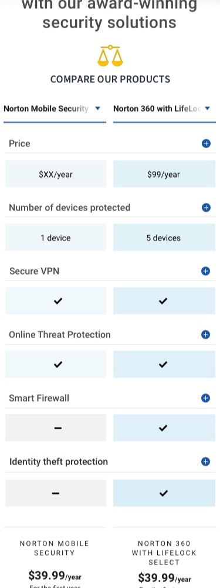

import DeviceFrame from '../../components/DeviceFrame.astro';
import ImageGrid from '../../components/ImageGrid.astro';
import MediaRow from '../../components/MediaRow.astro';
import VideoEmbed from '../../components/VideoEmbed.astro';
import SectionHeading from '../../components/SectionHeading.astro';

<SectionHeading level="section">Customers love comparison charts</SectionHeading>

We knew our customers liked comparison charts based on years of optimisation and user testing results. Comparison charts are an efficient and effective way to convey large amounts of information in a digestible and discoverable way. We needed to find a way to leverage the benefits of comparison charts for the smaller viewport sizes of mobile browsers. We hadn't leveraged this insight effectively on our mobile website, so I initiated the project in tandem with our PM and dev teams. As well as conceptualising the approach, I also took the lead on the UX and visual design process.

<SectionHeading level="section">Research</SectionHeading>

It was important to benchmark what other competitors were doing, so we did an analysis across a range of industries — competitors (Avast, AVG, McAfee) and leading online retailers (Amazon, Best Buy, Apple). We wanted to find best-in-class ideas and explore the value of each approach to find any potential gems we could leverage, and through this process we were able to identify a number of common approaches to presenting product features.

<ImageGrid cols={3}>
<DeviceFrame variant="mobile">

</DeviceFrame>

<DeviceFrame variant="mobile">
  
</DeviceFrame>

<DeviceFrame variant="mobile">
  
</DeviceFrame>

<DeviceFrame variant="mobile">
  
</DeviceFrame>

<DeviceFrame variant="mobile">
  
</DeviceFrame>

<DeviceFrame variant="mobile">

</DeviceFrame>
</ImageGrid>

<MediaRow reverse>
<DeviceFrame slot="image" variant="mobile">

</DeviceFrame>
<SectionHeading level="section">Wireframes</SectionHeading>

Initially it was useful to put together some wireframes to quickly figure out how the page would come together. I created low-fidelity wireframes to map out how the configurable comparison chart could work, using Figma both for the wireframes and to create quick prototypes to test the interactions of the drop-downs and informational expanders. I also wanted to run them through user testing. I went through three iterations before landing on a set I was confident would work.

</MediaRow>

<SectionHeading level="section">User testing</SectionHeading>

Before going too far with the idea I wanted to validate it with user testing. We already knew our users liked comparison charts, but this was a new approach, so I needed to be sure it would resonate. I started qualitative testing during the wireframing stage to make sure customers would understand the concept, targeting testers 25+, all remote and unmoderated.

Test users responded favourably: they liked the pinned product name and pricing, the expandable features, and the switchable side-by-side products. It was promising validation of the core ideas and gave me confidence to continue.

<MediaRow>
<DeviceFrame slot="image" variant="mobile">

</DeviceFrame>
<SectionHeading level="section">UI design</SectionHeading>

The visual style had to adhere to the existing brand and style of the website. All the imagery, fonts, styling and colours aligned with the global brand guidelines and worked with the broader context of experience flows customers would come from, integrating seamlessly with the wider mobile web experience.

Customers exploring the site needed a seamless experience which inspired confidence and helped them make an informed purchasing decision. Being able to compare different products side-by-side helped customers quickly understand the differences between our offerings and make the right purchase for their situation — helping users make informed choices helps achieve business goals through less confusion and more traffic to conversion.

</MediaRow>

<ImageGrid cols={2}>
<DeviceFrame variant="mobile">

</DeviceFrame>

<DeviceFrame variant="mobile">

</DeviceFrame>
</ImageGrid>

<VideoEmbed
  src="https://www.youtube.com/embed/-UurBLB3qBA?rel=0"
  title="Mobile comparison chart final version - Jeremy Monfries"
/>

<SectionHeading level="section">A/B testing</SectionHeading>

After visual design was completed, we ran the concept through A/B testing for 4 weeks. The concept was a success: we received positive user responses in qualitative testing and validation in A/B testing. The new challenger beat our control experience, adding $250k additional annual revenue and improving the customer experience of the brand.

<SectionHeading level="chapter">Final thoughts</SectionHeading>

Initially this project was risky because the business hadn't done anything like this before. As the initiator I needed to get multiple stakeholders onboard so the project would be prioritised and resources allocated. Although there were internal challenges, I was keen to solve this existing problem: how do we effectively communicate relevant information about Norton's products on a mobile device? There's limited space to communicate large amounts of information, but it could be done if we organised the information in the right way. I was worried this solution wouldn't help customers understand our products enough to buy — but the final output worked, and we were able to help users understand and make informed purchasing decisions, contributing to a positive lift the business was happy about.
