import DeviceFrame from '../../components/DeviceFrame.astro';
import ImageGrid from '../../components/ImageGrid.astro';
import ColumnGrid from '../../components/ColumnGrid.astro';
import NumberedSteps from '../../components/NumberedSteps.astro';

**Role:** Team Lead, Lead Product Designer

NortonLifeLock required an updated checkout experience as the existing experience was no longer appropriate for changes within the broader business.

NortonLifeLock's business is broadly segmented between customers looking for device security and those looking for identity theft protection. Our checkout was not adequately addressing the different expectations of these customer segments. We needed to create a unified checkout experience that could accommodate different customers with different needs. Our existing experience also contained too many steps and we were losing customers. We needed an experience that felt seamless, presented the right information at the right time, and helped reduce overall friction.

### My role

I was the lead designer and was responsible for the overall UX and visual design. I worked with a team consisting of another UX designer, PMs, and dev leads to ensure the project stayed on track. We liaised directly with various senior stakeholders across the business to manage expectations and communicate project status. The project was high profile and significant, as the checkout is NortonLifeLock's main place where customers purchase our products.

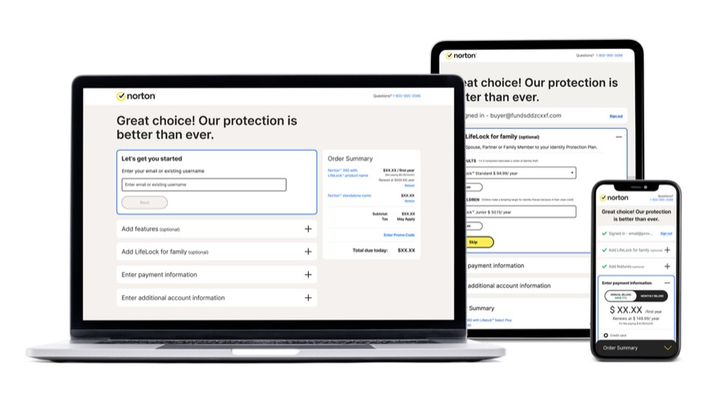

### Skills used

<ColumnGrid cols={2}>

- Human-centred design
- Journey mapping
- Landscape and literature review
- Competitive review
- User testing
- Userflows
- Prototyping

- Wireframes
- Interaction design
- Visual design
- Design system
- Accessibility compliance
- Collaboration
- Communication

</ColumnGrid>

### Research

I partnered with one other lead designer, one product manager, and one researcher to analyse competitors, review existing research and analyse internal UX repositories.

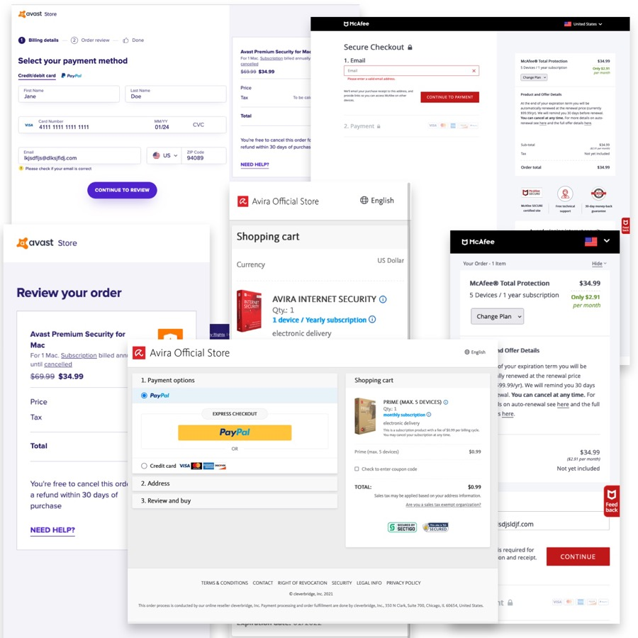

### Experience strategy & vision

I worked with my other lead designer to create wireframes and mock-ups to evangelise the vision, and to gain buy-in from senior stakeholders and other internal teams we needed involved, such as the front-end and back-end development teams.

### Design execution

I designed multiple wireframes and UI iterations based on research feedback to ensure the checkout worked across multiple platforms, and engaged the dev teams to make sure what we designed was feasible within the limitations of our existing tech stack.

<h2 style="text-align: left;">Project vision</h2>

#### Deliver a best-in-class checkout experience for all Norton and LifeLock customers

<ColumnGrid cols={2}>

### UX goals

- Reduce friction and minimise customer pain points
- Reduce friction on sign up / sign in
- Create a seamless UX from entry to exit points
- Service both Norton and LifeLock customers effectively and equally
- Consider all customer needs in checkout
- Feature additional products customers might find useful

### Business goals

- Grow conversions (target 5% revenue increase)
- Grow customer base
- Reduce business silos
- Improve integration between Norton and LifeLock products
- Compliance with WCAG 2.1 AA and ADA accessibility guidelines
- Accommodate multiple languages and regional requirements
- Up-sell and cross-sell additional secondary products

</ColumnGrid>

These challenges were important for a number of reasons. The company was under pressure to increase revenue, and the existing checkout was underperforming relative to our competitors — too many steps, too many forms, and an overly complicated login process. The checkout needed to address different product and customer needs: LifeLock and Norton have different user bases with different data requirements, such as Social Security Numbers and personal identification data for each user.

We negotiated with senior stakeholders to make sure the project addressed both business and customer needs, running workshops and design processes via Lean UX, ideation, competitor research and journey maps to tease out the most important problems to solve.

### Research

To ensure NortonLifeLock customers have the best possible experience, we undertook a thorough analysis via:

<NumberedSteps
  items={[
    "Reviewing our competitors' checkout processes",
    'Reviewing existing literature from leading research companies such as NN/g and the Baymard Institute',
    'Data-mining our extensive repository of existing internal reports and testing results',
  ]}
/>

This analysis was designed to evaluate the strengths and weaknesses of our competition, including McAfee, Kaspersky, Avast and Avira, and to identify useful and relevant information on how we could improve the NortonLifeLock checkout experience. The findings helped us make informed decisions about the design and functionality of the checkout process, ensuring it was both user-friendly and efficient, and allowing us to provide customers with a best-in-class experience while staying ahead of the competition.

## Listening and empathising with our customers

### User journey

User journey mapping helped identify the most frictionless options available, which we could then iterate on as the business clarified ongoing legal requirements. The team focused on identifying the bare minimum customer information we needed so customers could successfully purchase — including additional steps and information only when necessary — while presenting relevant additional product offerings at the right time in the journey. Through user testing and our extensive library of previous tests, we were able to focus on presenting the right offerings at the right times for the mix of products our customers were interested in.

There were a number of factors the team identified as crucial for success:

1. Reduce and remove unnecessary steps, input fields and lengthy forms
2. Help guide the user with timely and relevant interaction and animation
3. Minimise superfluous visual clutter

By exploring how our different steps were presented, we helped minimise customer fatigue and made the process seem shorter and easier to get through.

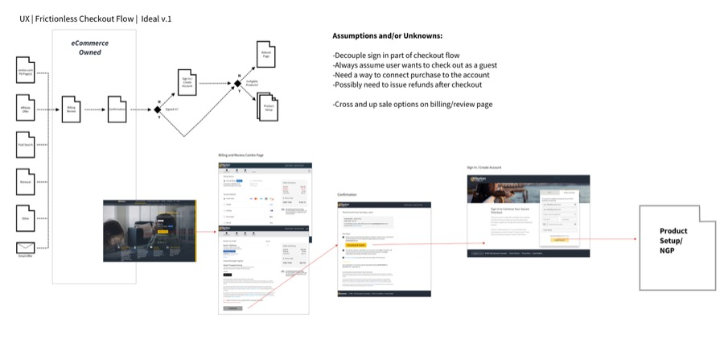

### Wireframes

At the beginning of our design process we created wireframes for testing purposes, starting with low-fidelity wireframes to quickly map out the customer journey. We wanted to rapidly explore options that effectively accommodated business requirements and user needs, using a variety of research inputs — competitive research, optimisation data and heuristic knowledge — as starting points, as well as data from our existing checkout. We also used wireframes as a brainstorming tool to get stakeholders onboard and to collect insights from them. We built them out in Sketch and InVision, then used Usertesting.com to get our ideas in front of users, iterating quickly while taking stakeholder input to rapidly develop validated and approved flows before moving to visual design.

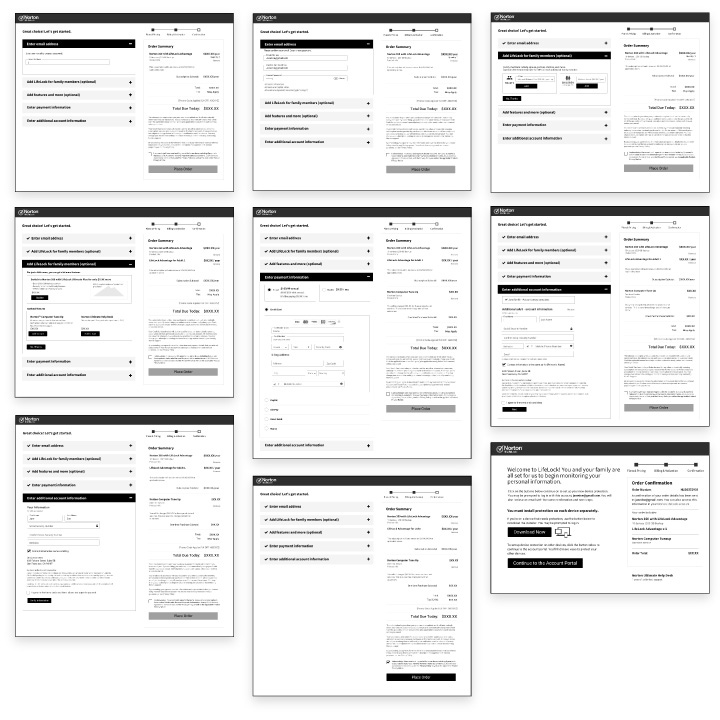

### User testing

The business had a large pool of data from existing checkouts which the team was able to leverage into useful insights, meaning we could focus on implementing them into the new checkout as well as building on this knowledge through more iterative testing as we built out wireframes and higher-fidelity flows. We primarily used a third-party usability testing platform to get rapid feedback from users, so we could identify potential issues as they came up and reduce risk later in the process.

We started running tests once we had wireframes of the experience flow. The checkout is used by a wide variety of people, so we tested regularly and broadly across demographics, focusing on the 25+ age group, since most of our customers are above 25 years old.

Our initial tests during the design process were all remote and unmoderated, as we wanted rapid feedback to keep our aggressive timelines. We were able to identify some key issues early and iterate until we had a functional experience.

After we had higher-fidelity prototypes, we moved into live A/B testing to ensure the new experience would not impact conversions.

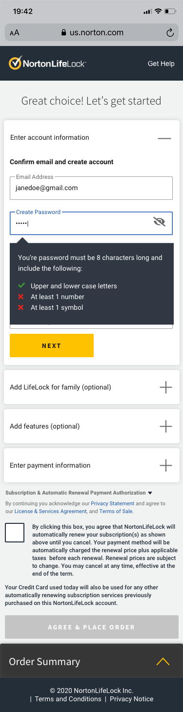

### UI design

The business wanted the new checkout design to follow the new corporate brand guidelines. We followed a lighter, brighter, minimalist style which removed any unnecessary elements, keeping users focused on the most important tasks in the checkout and minimising distractions. We used a reduced colour palette based on the corporate brand, while adhering to Web Accessibility (Level AA of ADA and WCAG standards).

We took into account both Material Design and Apple's HCI to inform the design and appeal to common UI elements between both, while being mindful that our customer base skews towards iOS users.

The checkout was designed to be responsive, targeting three breakpoints representing the most common device types — mobile, tablet and desktop — using analytics data to identify the most common screen resolutions our customers use, while ensuring the experience was robust enough to still work for other viewports. The solution we delivered balanced customer needs with business goals, the latest visual style, and technical limitations.

### Visual design iterations

<ImageGrid cols={2}>
<DeviceFrame variant="laptop">
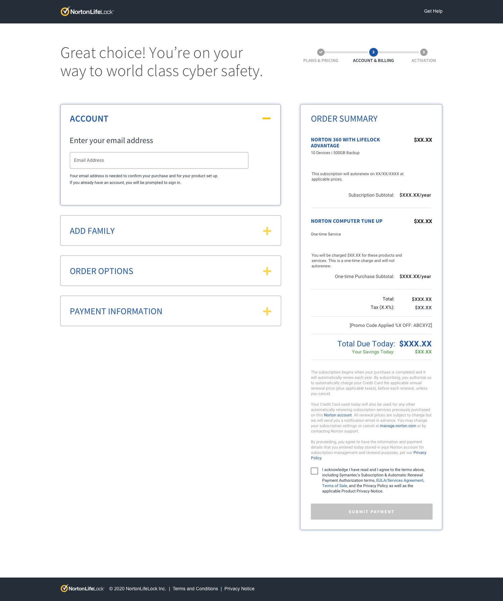
</DeviceFrame>

<DeviceFrame variant="laptop">
  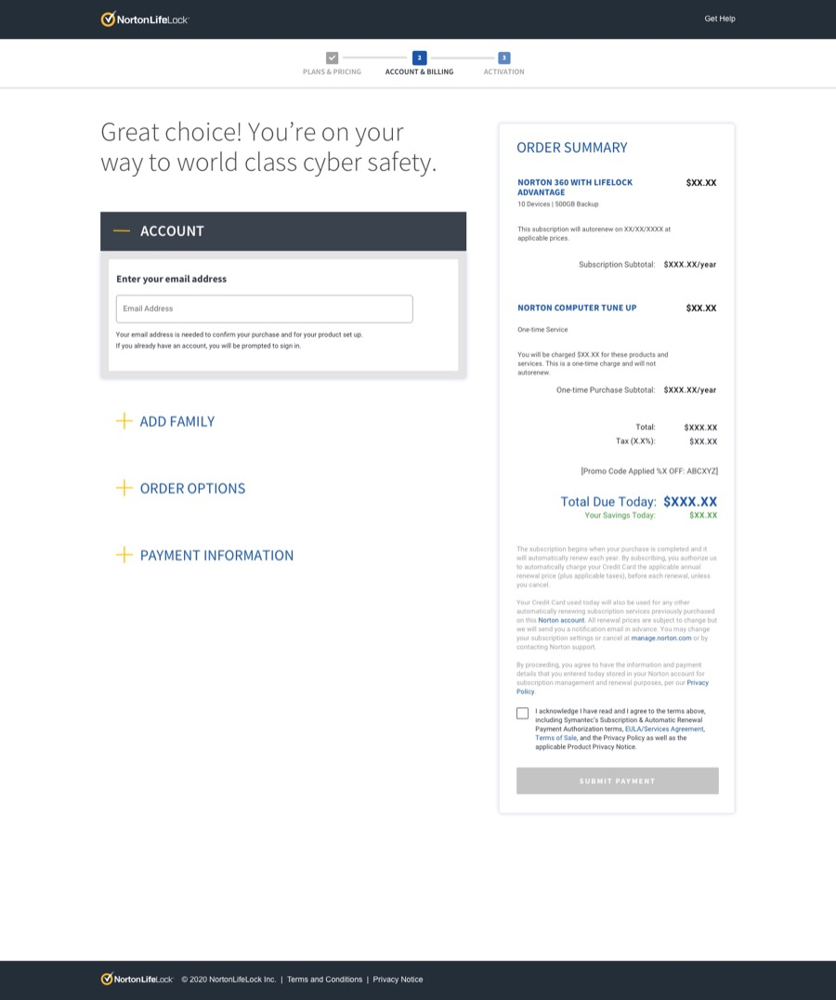
</DeviceFrame>

<DeviceFrame variant="laptop">
  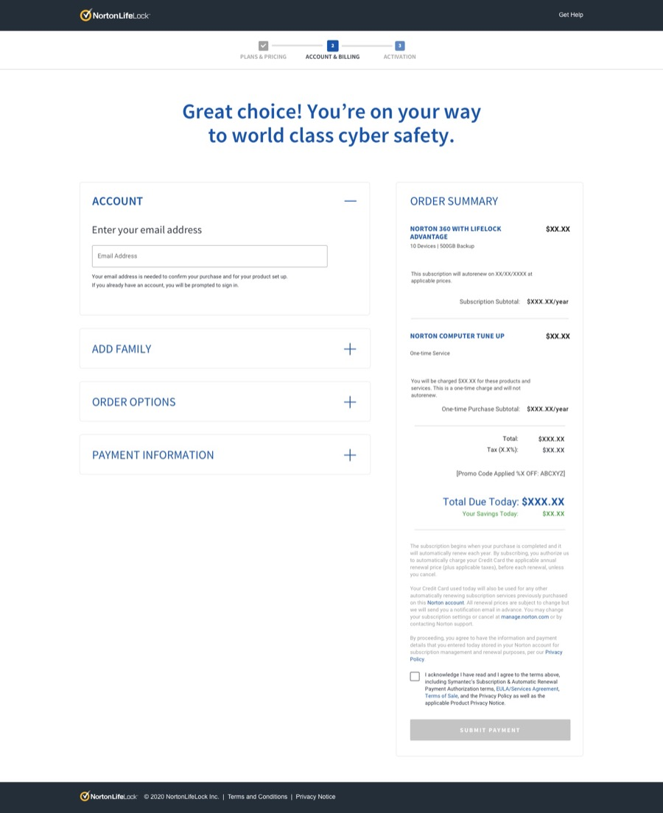
</DeviceFrame>

<DeviceFrame variant="laptop">
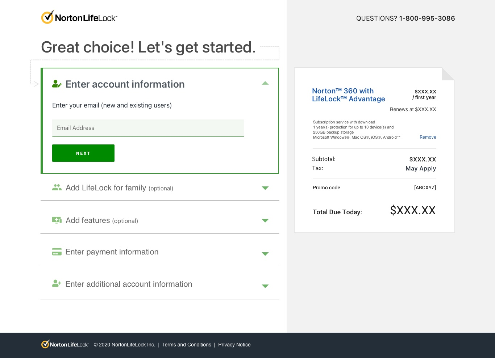
</DeviceFrame>
</ImageGrid>

### The final solution

<ImageGrid cols={2}>
<DeviceFrame variant="laptop">
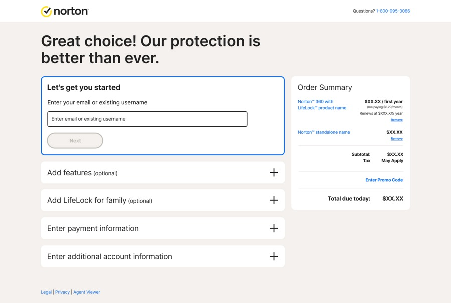
</DeviceFrame>

<DeviceFrame variant="laptop">
  
</DeviceFrame>

<DeviceFrame variant="laptop">
  
</DeviceFrame>

<DeviceFrame variant="laptop">
  
</DeviceFrame>

<DeviceFrame variant="laptop">
  
</DeviceFrame>

<DeviceFrame variant="laptop">
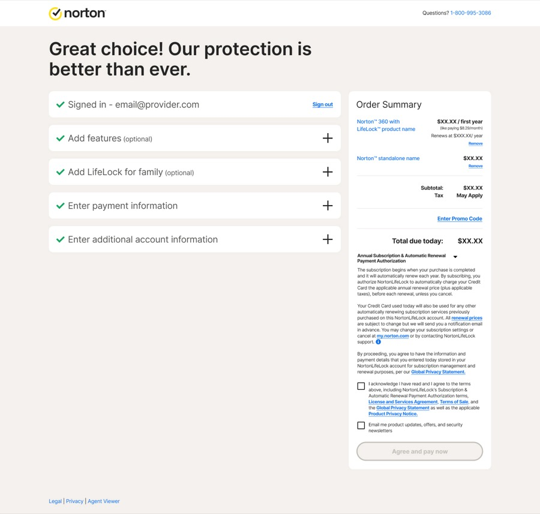
</DeviceFrame>
</ImageGrid>

<ImageGrid cols={2}>
<DeviceFrame variant="mobile">
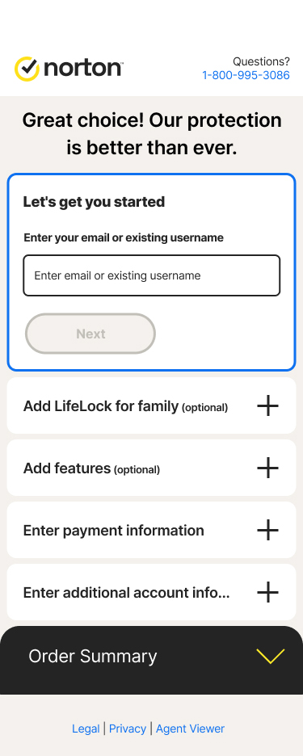
</DeviceFrame>

<DeviceFrame variant="mobile">
  
</DeviceFrame>

<DeviceFrame variant="mobile">
  
</DeviceFrame>

<DeviceFrame variant="mobile">
  
</DeviceFrame>

<DeviceFrame variant="mobile">
  
</DeviceFrame>

<DeviceFrame variant="mobile">
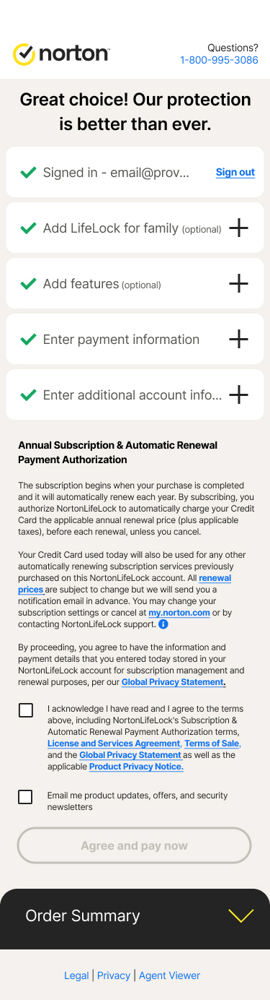
</DeviceFrame>
</ImageGrid>

## Final thoughts

My biggest concern during the project was whether we could deliver a better experience for our customers without ultimately hurting conversion. The transition from an existing experience to a new one always brings with it the possibility of delivering an inferior product, and aggressive timelines didn't help, as they impacted quality at every stage of the process. Significant internal changes at the time caused a lack of clarity around roles and responsibilities, and we also had challenges with legacy technical issues we were not able to solve for the first iteration of the project. The project also would have benefited from a C-level design advocate operating within a DesignOps role.

Although we faced these headwinds, we were still able to deliver a streamlined customer experience that met all business requirements. Working as a team and employing Scrumban methodology, we were able to reach across the organisation at the right times to get the project delivered — successfully bringing customer needs together with business goals within the confines of technical limitations, and delivering a significant increase in revenue.
