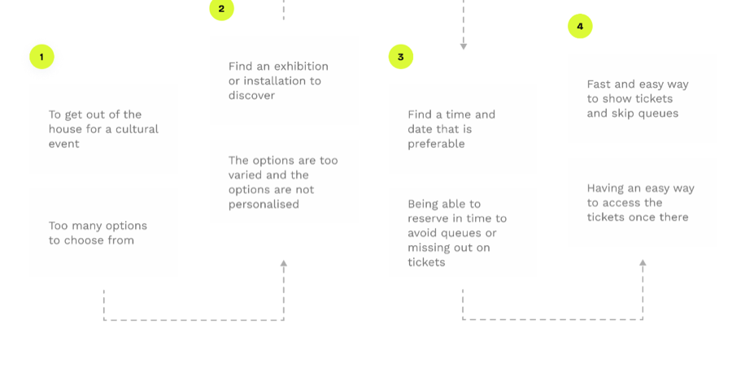

**Role:** Lead Product Designer

**Team:** Product owner, business analyst, 3 engineers

**Timeline:** Sep – Dec 2025 (16 weeks)

As lead designer I owned the experience end to end across both surfaces: the discovery audit and experience map, the prototype design, the usability test plan, and the final design recommendation to senior stakeholders. I partnered closely with product, engineering, research and compliance, and led the calls on where the customer and banker flows should align and where they should deliberately differ.

### Problem

FYB technically worked, but it no longer matched the bank's new design system intent for onboarding — a friendlier, more conversational self-serve experience, and aligned customer and banker journeys where the same job gets done. Unhappy paths felt inconsistent and often stopped at naming the issue (for example, "inactive ABN") without defining it or giving a confident next step. These gaps increased uncertainty, reduced completion, and produced mismatched or duplicate records that teams had to fix later. At the same time, anti-money-laundering reform raised identification expectations without allowing extra friction or longer time to open.

### Solution

I redesigned FYB across both surfaces on the new design system, treating identification as verification, not data entry. I promoted ABR lookup to equal weight with typed ABN entry, rewrote error and no-match states to include plain-English definitions plus a clear next action, and rebuilt the no-ABN path as a guided route through business structure. I aligned customer and banker patterns by default, then kept deliberate differences only where the banker job genuinely needed extra controls or context. Compliance partnered throughout so requirements shaped the design early, instead of arriving as a final gate.

### User journey

The journey starts when a customer begins business onboarding and reaches "Find your business," where they try to identify their entity using ABN or ACN, or by choosing a no-ABN path. Many customers first leave the flow to look up their ABN using ABR search, then return to verify they selected the correct business from results. If the system finds no match or flags an issue (inactive or deregistered), the customer needs a clear explanation of what that status means and what to do next, otherwise they hesitate or abandon. In the banker-assisted journey, the banker performs the same identification job but needs additional context and controls for edge cases and on-behalf-of completion, so alignment matters for consistency — but the differences must stay intentional. The redesign focused on making each decision point feel like a confidence check with visible evidence (matched details, definitions, next steps) rather than a guessing game.

### Interviews

To ground the redesign in real behaviour, I started with a discovery audit and an end-to-end experience map of the live FYB flow across both surfaces, documenting every happy path, unhappy path, branch and dead end. That map became the shared artefact for product, engineering, research and compliance to review, so we could debate decisions using observed flow behaviour rather than assumptions. I then partnered with research to validate key friction points through an unmoderated remote study with eight participants, using click-through prototypes across the happy path, error states, and the no-ABN-and-trust entry route. The study combined task completion, time on task, ratings, and think-aloud responses, which helped explain why high satisfaction scores still hid sharp drop-off risks in edge cases.

**Finding 1**

#### ABN recall rarely happens in the real world

Most participants treated ABR lookup as the first step, not a fallback, so typed-ABN-only flows created avoidable friction.

**Finding 2**

#### Error messages created uncertainty instead of decisions

"Inactive ABN" triggered multiple conflicting interpretations and left users without a confident next action.

**Finding 3**

#### The no-ABN and trust entry route carried the highest effort

This path showed the highest time on task and click counts, revealing a navigation problem, not a motivation problem.

### Learnings

- A single annotated experience map across customer and banker surfaces can become a source of truth that prevents accidental drift and speeds cross-functional decision making.
- High quantitative scores can hide edge-case failures, so I now treat error states as first-class scenarios to test, not secondary screens.
- Compliance works best as a co-designer early in the process, because it turns regulatory constraints into design inputs instead of late-stage rework.

### Next steps

- Run follow-up research on mobile breakpoints for FYB to confirm readability, focus order, and decision clarity under smaller screen constraints.
- Extend the same error-state patterns and definitions into downstream onboarding steps (contact, KYC, document upload) to keep language consistent.
- Track longer-term data quality signals (duplicate merges, manual remediation types) to isolate which unhappy paths still drive avoidable tickets.
