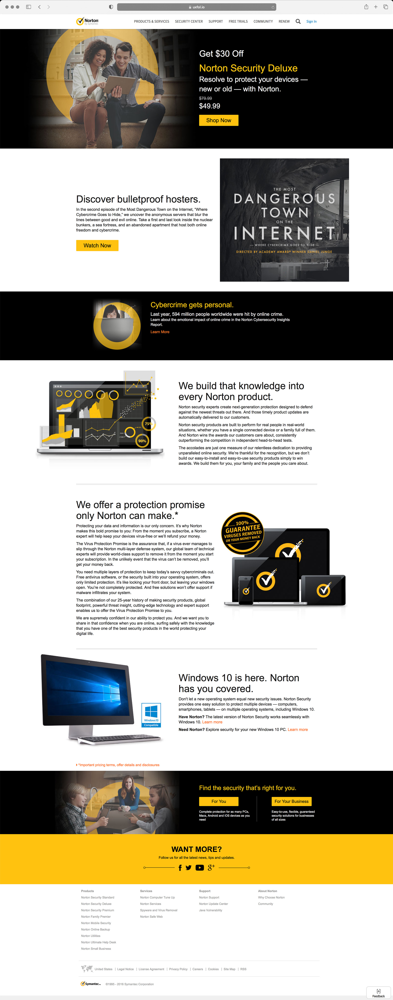
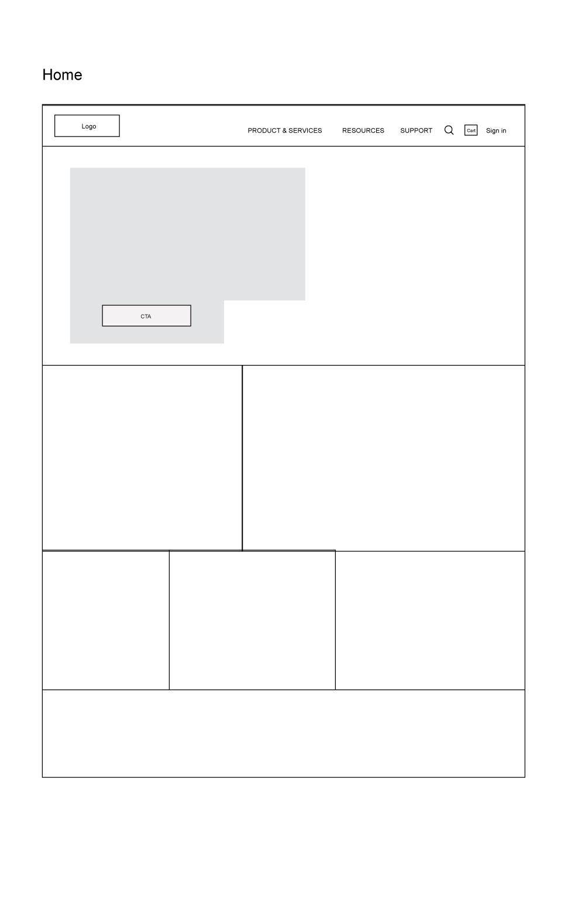
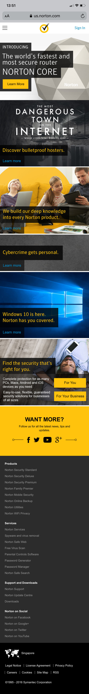
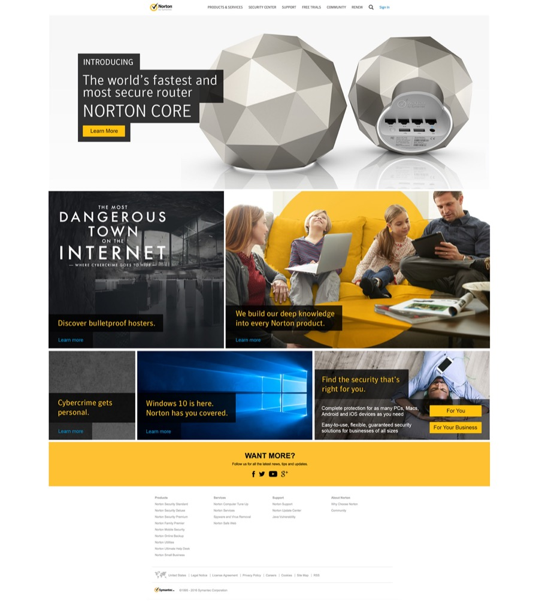

import DeviceFrame from '../../components/DeviceFrame.astro';
import ImageGrid from '../../components/ImageGrid.astro';
import ColumnGrid from '../../components/ColumnGrid.astro';
import MediaRow from '../../components/MediaRow.astro';
import SectionHeading from '../../components/SectionHeading.astro';

### Norton's homepage needed a refresh

As part of a larger project to refresh the whole Norton website, the business needed a new homepage design. The existing page was looking dated and wasn't adequately serving the needs of the business. A number of internal stakeholders wanted a way to connect ongoing promotions in the market with the homepage so the experience flow was continuous — the existing homepage only had space for one promotion, which didn't work when multiple promotions ran at the same time. We also needed to balance stakeholder needs with the needs of the customer — essentially, we needed to be their voice.

Although this was primarily driven by internal business stakeholders, there was also a potential benefit to our customers, since we could surface more relevant products and services. We needed to be careful that we weren't sacrificing customer needs for the sake of internal business requirements.

My role on the project was lead designer, and I worked with the creative director, UX director and a number of business leaders. We needed to create wireframes and identify critical flows to make sure our solution addressed both customer needs and business stakeholder needs. The solution needed to be flexible enough to present different types of information (offers, sales, promotions) while still following a defined structure, to maintain brand standards and a digestible information hierarchy.

<SectionHeading level="chapter" align="left">
  Project vision
</SectionHeading>

#### Deliver a new homepage that helps customers find the right product quickly

<ColumnGrid cols={2}>

### UX goals

- Help customers find useful and relevant product offerings quickly
- Help customers get the best prices on products
- Help customers understand the different products on offer

### Business requirements

- Reduce customer drop-offs from the homepage
- Promote upsells and cross-sells
- Increase customer engagement with our products and brands
- Provide areas for different business units to promote their products

</ColumnGrid>

<MediaRow>
<DeviceFrame slot="image" variant="laptop">

</DeviceFrame>
### The existing experience

The existing experience was looking dated. The images, fonts and copy style all needed a lift — the photos were part of an older brand campaign, and new images were being rolled out. The brand fonts had been updated, and it was time to use them more comprehensively across the site as the company finally embraced custom fonts rather than default web fonts. The homepage was also overly focused on secondary information, with overly concocted marketing copy and simply too much copy. The company needed the page to be more product-focused and centred around explaining product features.

</MediaRow>

<MediaRow reverse>
<DeviceFrame slot="image" variant="laptop">

</DeviceFrame>
### Wireframes

The team created a number of wireframes to map out the structure and get consensus on the copy strategy, mapping out the types of content that would be displayed and roughly how much copy would appear. We wanted to ensure we were creating the right solution that prioritised UX while also accommodating multiple stakeholders with conflicting agendas.

The UX director initially created low-fidelity wireframes. After a number of iterations and discussions with stakeholders, we created high-fidelity wireframes and ran them through user testing.

</MediaRow>

### UI design

The corporate brand was focused on bright, white pages with Norton yellow highlights — fresh, friendly and personable. I based my design on the corporate brand, trying to stay on-brand while also moving the brand forward. Security can be a bit dry and impersonal, so I wanted to let the imagery speak, focusing on people, lifestyles and the personal side of security. We continued to follow a responsive/adaptive hybrid approach with three breakpoints optimised for mobile, tablet and desktop.

I was happy that the final product fulfilled the requirement for all sections of the business to have space to run promotions important to them. The design served customers by bringing a mix of product offerings and security information together in a relevant way, with content personalised based on where the user had come from and whether they had an account with us.

## The final designs

<ImageGrid cols={2}>
<DeviceFrame variant="mobile">

</DeviceFrame>

<DeviceFrame variant="mobile">
  
</DeviceFrame>
</ImageGrid>

<ImageGrid cols={2}>
<DeviceFrame variant="laptop">
  
</DeviceFrame>

<DeviceFrame variant="laptop">
  
</DeviceFrame>

<DeviceFrame variant="laptop">
  
</DeviceFrame>

<DeviceFrame variant="laptop">

</DeviceFrame>
</ImageGrid>

## Some learnings

There were so many stakeholders across the business in various silos that I was concerned this project would end up being a failure for our customers. As I've seen on numerous occasions, too many conflicting internal, myopic interests result in a substandard product. Luckily we had some strong design leaders who were able to wrangle and cajole them towards a viable solution — there always has to be someone in the business at a senior level who truly represents the voice of the customer.
