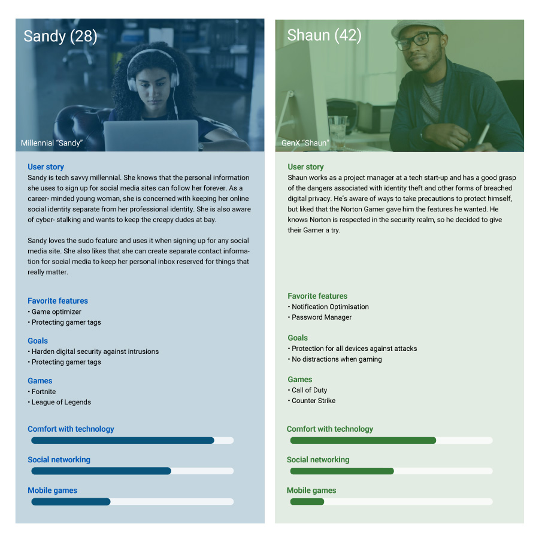
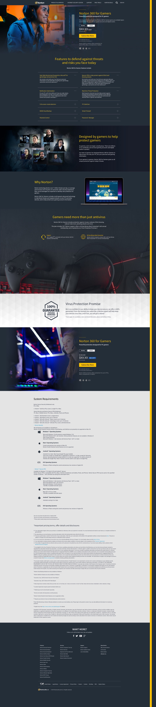

import ImageGrid from '../../components/ImageGrid.astro';

NortonLifeLock was launching a new global product specifically targeted at the gamer demographic. This customer segment had unique requirements around performance that weren't being serviced by our other products. Gamers have a greater need for security due to their exposure to multiple attack vectors and their investment in digital assets and identities — and speed is key, so they needed software optimised to have as little impact on computer performance as possible. With the new product, the business needed a landing page that would resonate with this tricky market segment. I worked on the visual design and UX in conjunction with a copywriter and liaised directly with the lead stakeholder for the project.

### Personas

It was important to correctly identify the gamer persona we were targeting. We knew gamers hailed from across a wide range of age groups, but we needed to identify the ones most likely to buy this product.

To develop our personas we used a variety of data sources — marketing research and surveys — to ensure the features and imagery were relatable and made sense to gamers. We also wanted authenticity, so we got insights from internal staff who were hardcore gamers themselves. We distilled this data into two key personas that captured the gamer demographic.

### User testing

We launched some quick qualitative tests to see if our page designs were on the right track — whether users responded to the page text and imagery, found the product compelling, and had enough information to move to purchase.

Our tests were remote and unmoderated, and we initially tested within our target demographic, then ran additional tests to capture insights from users outside it, to see whether our core market resonated and whether we were also appealing to other groups. We found some of our images and text weren't resonating, so we rectified those issues and tested until we had a solid final design.

### Visual design

The page design was in keeping with the rest of the site and adhered to the corporate brand style — at the time, the site was dark and evoked a sleek, tech aesthetic.

The page needed to work on multiple devices, so I used a responsive/adaptive hybrid layout, the approach used across the broader website, with specific breakpoints for mobile, tablet and desktop that were each adaptive.

Imagery was chosen to resonate with gamers and potentially appeal to our existing customers too — we used images of real gamers from within the company, and enlisted the help of Twitch streamers with active sponsorships and promos. We surfaced relevant product information directly and displayed more detailed information via accordions.

<ImageGrid cols={3}>

</ImageGrid>

## Final thoughts

I wanted to be sure we were presenting the new product in an optimal way, and I was worried the new Gamer product would fail because our page wasn't communicating properly to customers. New products can be tricky to launch, as there's no control to work from and nothing to measure against — success is measured after the fact, so there's always a fear it won't sell at all. Although page design is only one factor in success, it's often the design that's held responsible for failure. Fortunately the product gained traction and the page is converting.
