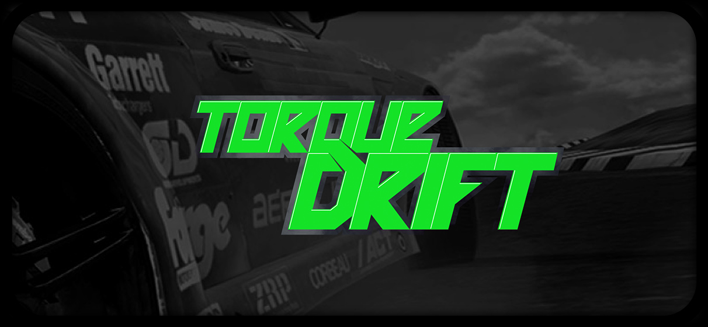
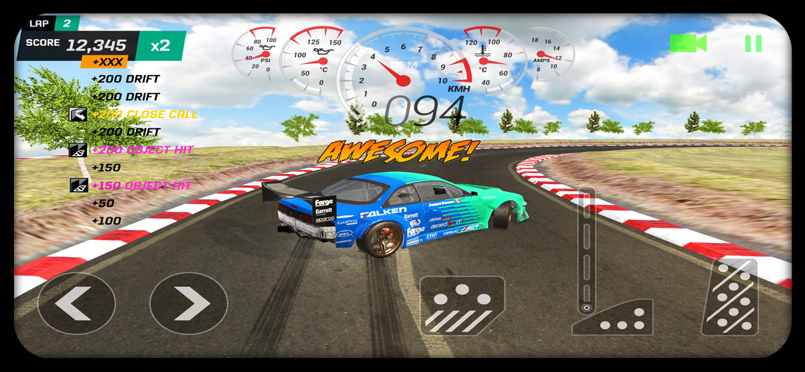
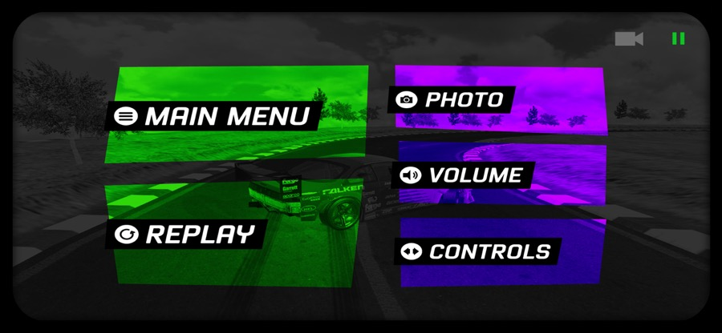
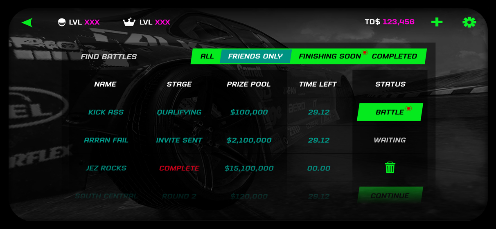
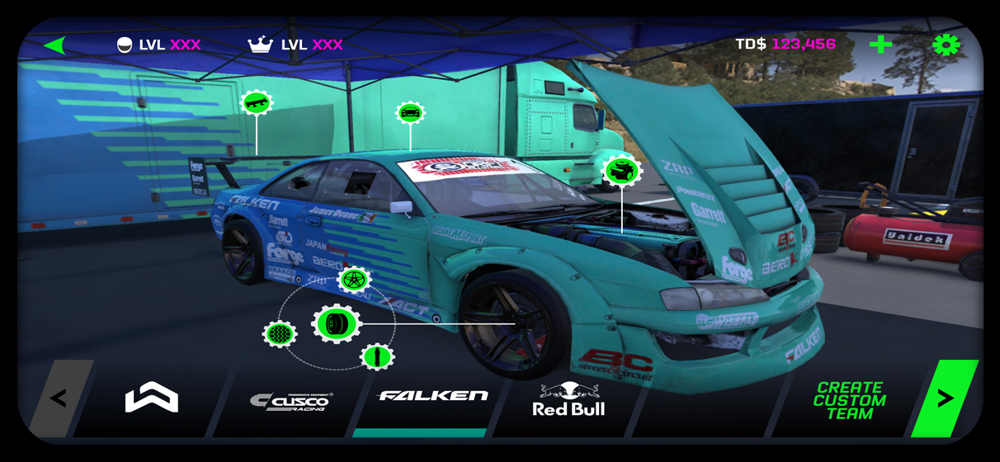
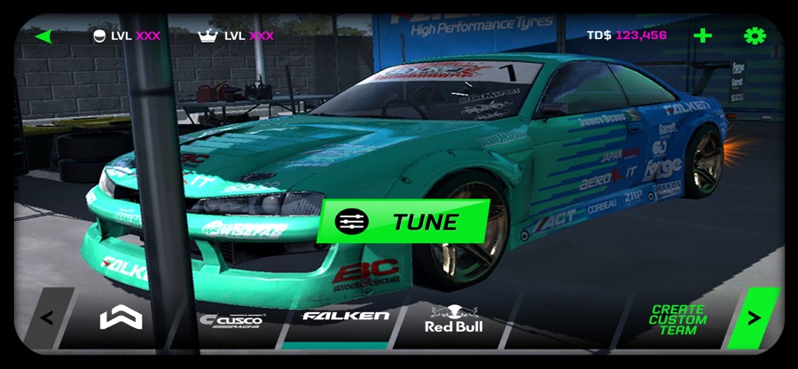
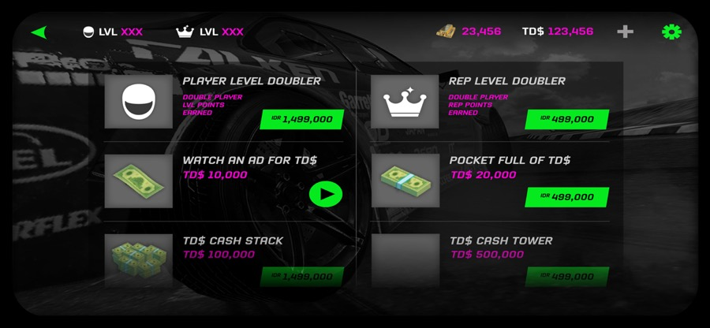
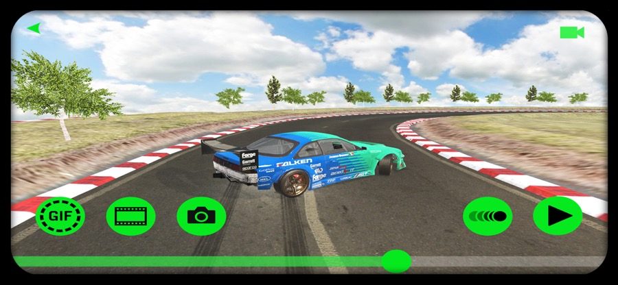
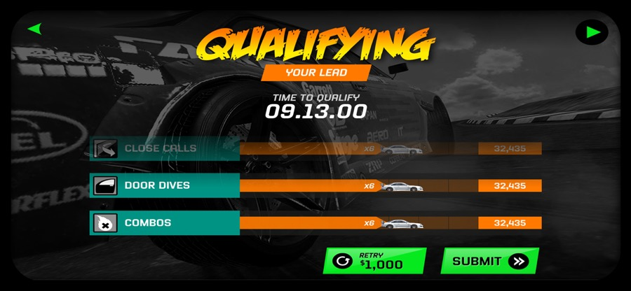
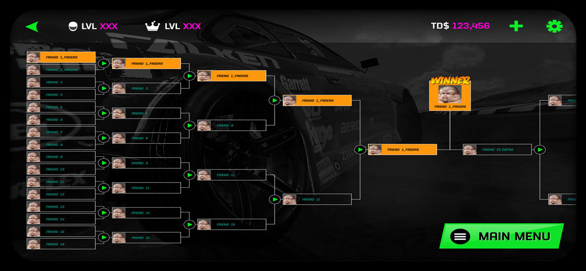

import DeviceFrame from '../../components/DeviceFrame.astro';
import ImageGrid from '../../components/ImageGrid.astro';
import FullBleedImage from '../../components/FullBleedImage.astro';
import SectionHeading from '../../components/SectionHeading.astro';
import infoArchitectureImg from '../../assets/case-studies/torque-drift/01.png';
import wireframesImg from '../../assets/case-studies/torque-drift/02.jpg';

<SectionHeading level="section">The project</SectionHeading>

An exciting opportunity presented itself when a business acquaintance reached out with a proposition — to join a new game project he'd been working on. He'd successfully launched a previous game, Torque Burnout, and wanted to make a new game with a new business partner. The new project was a high-octane car drifting game that would feature fierce online head-to-head drift racing, and he needed a business partner and specialist who could help with game conceptualisation, game design, game mechanics and user experience. The game would include a virtual store where players could purchase car upgrades and modifications from real-world companies, requiring relationships and contracts to be built, and some tracks would be replicas of real-world tracks, needing agreements with the respective parties. This was a chance to create something truly revolutionary, and I was excited to be part of it.

We planned a variety of monetisation methods, including in-game purchases, subscriptions and advertising, to generate revenue we could invest back into development and promotion. We also sought out partnerships and acquisitions that brought new audiences and revenue streams — fortunately we had existing contacts in F1 motorsport and drag racing which we were able to leverage successfully, along with a good existing relationship with the App Store that helped the game get featured and gave us access to useful insights on analytics, user feedback, marketing and the review and approval process.

My time on the project gave me valuable experience in leadership and strategy, relationship building, contract negotiation, product development, monetisation and continuous improvement.

<SectionHeading level="section">The Torque Drift vision</SectionHeading>

Our vision was to create a car drifting mobile game that immerses players in a high-octane, adrenaline-pumping racing experience, featuring realistic car physics, compelling smoke effects, authentic tracks and customisable vehicles. Through a combination of cutting-edge game design, immersive user experience and unparalleled realism, we aimed to revolutionise the mobile gaming industry and establish ourselves as the premier destination for car drifting enthusiasts.

<SectionHeading level="section">My role</SectionHeading>

As the business partner, my expertise in leadership and business strategy was critical in shaping the direction of the company, and my ability to build relationships and draft contracts with industry partners and clients helped secure new business and expand our reach. My understanding of game design, mechanics and user experience allowed me to contribute to the conceptualisation and development of Torque Drift, and I brought a valuable perspective by identifying new opportunities, partnerships and revenue streams to help the company stay competitive in the mobile gaming industry.

As Head of UX, I played a central role in ensuring Torque Drift was not only fun and engaging but also easy to use and intuitive for players. I owned the design process end to end, from user research through wireframes, prototypes and final designs, and worked closely with the development team to ensure designs were implemented correctly and tested for usability — work that was key in establishing Torque Drift as a leader in the drift-racing mobile gaming niche.

<SectionHeading level="section">Information architecture</SectionHeading>

<FullBleedImage src={infoArchitectureImg} alt="Torque Drift information architecture diagram" />

<SectionHeading level="section">Wireframes</SectionHeading>

<FullBleedImage src={wireframesImg} alt="Torque Drift wireframes" />

<SectionHeading level="section">UI/UX design</SectionHeading>

<ImageGrid cols={1}>
<DeviceFrame variant="mobile-landscape" fit>

</DeviceFrame>

<DeviceFrame variant="mobile-landscape" fit>
  
</DeviceFrame>

<DeviceFrame variant="mobile-landscape" fit>
  
</DeviceFrame>

<DeviceFrame variant="mobile-landscape" fit>
  
</DeviceFrame>

<DeviceFrame variant="mobile-landscape" fit>
  
</DeviceFrame>

<DeviceFrame variant="mobile-landscape" fit>
  
</DeviceFrame>

<DeviceFrame variant="mobile-landscape" fit>
  
</DeviceFrame>

<DeviceFrame variant="mobile-landscape" fit>
  
</DeviceFrame>

<DeviceFrame variant="mobile-landscape" fit>
  
</DeviceFrame>

<DeviceFrame variant="mobile-landscape" fit>

</DeviceFrame>
</ImageGrid>

<SectionHeading level="chapter">Learnings</SectionHeading>

Working as a business partner at League of Monkeys taught me several valuable lessons. One of the most important was the value of clear communication and alignment on goals and priorities — having open and honest conversations about expectations, plans and challenges at regular intervals, and making sure everyone is on the same page. I also learned the importance of a shared understanding of company structure and operations, including financial management and resource allocation, to avoid conflicts and misunderstandings, along with the value of flexibility and adaptability in a constantly evolving industry, a diverse team with different skills and perspectives, and a strong company culture.

Unfortunately the partnership didn't work out, because we couldn't agree on how the company should be structured and operated. These disagreements became more pronounced as we began to put our plans into action, and despite our best efforts to find a compromise, the partnership eventually ended. It was a difficult and frustrating experience, but one that taught me the importance of having a clear and aligned understanding of a company's structure and operations from the very beginning of any business partnership.
